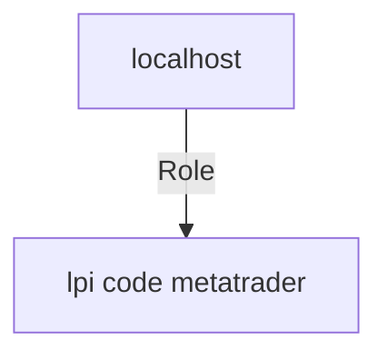

<!-- DOCSIBLE START -->

# 📃 Role overview

## Quick Start

To install metatrader 5 on Ubuntu or Debian target host (or any other machine with ssh access to the target), run the following command:

```bash
 curl https://raw.githubusercontent.com/lpi-code/lpi_code.metatrader/refs/heads/main/setup.sh | bash && cd lpi-code.metatrader && bash launch.sh
```


## lpi-code.metatrader


Description: Install metatrader 5 on Ubuntu or Debian


| Field                | Value           |
|--------------------- |-----------------|
| Readme update        | 05/02/2025 |


### Defaults

**These are static variables with lower priority**

#### File: defaults/main.yml

| Var          | Type         | Value       |Required    | Title       |
|--------------|--------------|-------------|-------------|-------------|
| [metatrader_user](defaults/main.yml#L3)   | str   | `metatrader` |    n/a  |  n/a |
| [metatrader_password](defaults/main.yml#L4)   | str   | `metatrader` |    n/a  |  n/a |
| [metatrader_group](defaults/main.yml#L5)   | str   | `metatrader` |    n/a  |  n/a |
| [metatrader_home](defaults/main.yml#L6)   | str   | `/home/metatrader` |    n/a  |  n/a |
| [metatrader_nb_profiles](defaults/main.yml#L7)   | int   | `1` |    n/a  |  n/a |
| [metatrader_mt5_url](defaults/main.yml#L8)   | str   | `https://download.mql5.com/cdn/web/metaquotes.software.corp/mt5/mt5setup.exe` |    n/a  |  n/a |
| [metatrader_webview_url](defaults/main.yml#L9)   | str   | `https://msedge.sf.dl.delivery.mp.microsoft.com/filestreamingservice/files/c1336fd6-a2eb-4669-9b03-949fc70ace0e/MicrosoftEdgeWebview2Setup.exe` |    n/a  |  n/a |


### Tasks


#### File: tasks/main.yml

| Name | Module | Has Conditions |
| ---- | ------ | --------- |
| Gather facts | ansible.builtin.setup | False |
| Update apt cache | ansible.builtin.apt | True |
| Install xfce | ansible.builtin.include_role | False |
| Install dependencies | ansible.builtin.package | False |
| Install xrdp | ansible.builtin.include_role | False |
| Create group | ansible.builtin.group | False |
| Add user | ansible.builtin.user | False |
| Create Deskop folder | ansible.builtin.file | False |
| Install winehq | ansible.builtin.include_role | False |
| Download metatrader installer and webview | ansible.builtin.get_url | False |
| Install metatrader profile(s) | ansible.builtin.script | False |
| Edit desktop shortcut for Editor to include name | ansible.builtin.replace | False |
| Edit desktop shortcut for Trader to include name | ansible.builtin.replace | False |


## Task Flow Graphs


### Graph for main.yml

```mermaid
flowchart TD
Start
classDef block stroke:#3498db,stroke-width:2px;
classDef task stroke:#4b76bb,stroke-width:2px;
classDef includeTasks stroke:#16a085,stroke-width:2px;
classDef importTasks stroke:#34495e,stroke-width:2px;
classDef includeRole stroke:#2980b9,stroke-width:2px;
classDef importRole stroke:#699ba7,stroke-width:2px;
classDef includeVars stroke:#8e44ad,stroke-width:2px;
classDef rescue stroke:#665352,stroke-width:2px;

  Start-->|Task| Gather_facts0[gather facts]:::task
  Gather_facts0-->|Task| Update_apt_cache1[update apt cache<br>When: **ansible os family     debian  or ansible os family<br>    ubuntu**]:::task
  Update_apt_cache1-->|Include role| webofmars_xfce4_desktop2(install xfce<br>include_role: webofmars xfce4 desktop):::includeRole
  webofmars_xfce4_desktop2-->|Task| Install_dependencies3[install dependencies]:::task
  Install_dependencies3-->|Include role| robertdebock_xrdp4(install xrdp<br>include_role: robertdebock xrdp):::includeRole
  robertdebock_xrdp4-->|Task| Create_group5[create group]:::task
  Create_group5-->|Task| Add_user6[add user]:::task
  Add_user6-->|Task| Create_Deskop_folder7[create deskop folder]:::task
  Create_Deskop_folder7-->|Include role| jakoblichterfeld_winehq8(install winehq<br>include_role: jakoblichterfeld winehq):::includeRole
  jakoblichterfeld_winehq8-->|Task| Download_metatrader_installer_and_webview9[download metatrader installer and webview]:::task
  Download_metatrader_installer_and_webview9-->|Task| Install_metatrader_profile_s_10[install metatrader profile s ]:::task
  Install_metatrader_profile_s_10-->|Task| Edit_desktop_shortcut_for_Editor_to_include_name11[edit desktop shortcut for editor to include name]:::task
  Edit_desktop_shortcut_for_Editor_to_include_name11-->|Task| Edit_desktop_shortcut_for_Trader_to_include_name12[edit desktop shortcut for trader to include name]:::task
  Edit_desktop_shortcut_for_Trader_to_include_name12-->End
```




## Playbook

```yml
---
- hosts: localhost
  remote_user: root
  roles:
    - lpi-code.metatrader

```
## Playbook graph


## Author Information
lpi-code

#### License

GPL-3.0-only

#### Minimum Ansible Version

2.1

#### Platforms

No platforms specified.
<!-- DOCSIBLE END -->